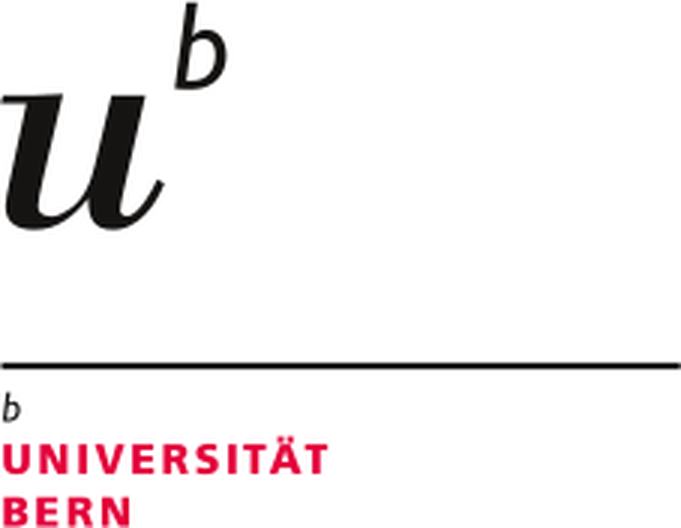

::: {.content-visible when-format="typst"}
::: {layout-ncol="2" layout-valign="bottom"}
{width="26mm" fig-alt="Universität Bern"}

{width="42mm" fig-alt="Digital Humanities, Universität Bern"}
:::

# DH Ringvorlesung

**Herbstsemester 2026 — Programm**


:::









## Kontakt

Universität Bern · Walter Benjamin Kolleg / Digital Humanities · Muesmattstrasse 45 · 3012 Bern

digitalhumanities\@unibe.ch · <https://www.dh.unibe.ch/>

Laufend aktualisierte Fassung: <https://dhbern.github.io/dh-lecture-series/2026/>
